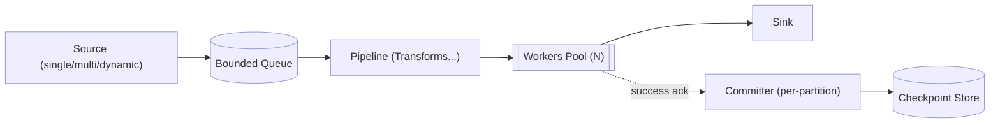
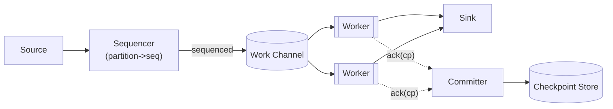
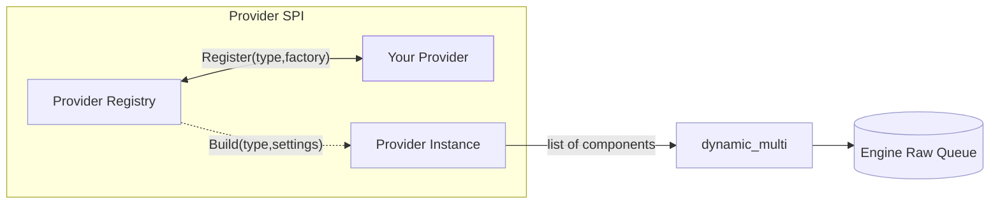

# Go ETL（插件化采集 / 处理 / 投递框架）

一个轻量的企业级 Go ETL / 数据采集框架骨架，定位为「Go 版 Kafka Connect / Logstash 的可嵌入内核」：

- 插件化 Source / Transform / Sink
- 高吞吐（并发 worker + 有界队列背压）
- 可扩展（注册表 + 配置装配）
- 支持断点续扫（checkpoint 顺序提交）
- 支持 backpressure（channel buffer 控制流量）
- 支持 metrics（抽象层 + 内置 Nop / Atomic 实现）

## 架构

核心数据流：

```
Source -> (bounded queue) -> Pipeline -> Worker Pool -> Sink
                        \-> Ack/Commit -> Checkpoint Store
```

Mermaid（总览）：



关键点：

- **背压**：Source 写入有界 buffer channel；下游慢时 channel 填满，Source 自动阻塞降速。
- **断点续扫**：Source 产生消息时可以携带 Checkpoint；worker 成功写入 Sink 后 ack；committer 以 partition 内序号保证 **按序提交 checkpoint**，避免并发导致 checkpoint 跳跃。
- **批处理 Sink**：Sink 可选实现 BatchSink，worker 自动进行 batch + flush。
- **动态伸缩**：运行中可通过 `Engine.SetWorkers(n)` 调整并发，内部会定期 reconcile。

Engine 内部流转（Mermaid）：



## 目录结构

```
goetl
  engine/        调度引擎（背压、worker、checkpoint commit）
  plugin/        插件注册表（source/transform/sink/checkpoint/metrics）
  config/        配置结构与 settings 解码
  checkpoint/    checkpoint 抽象
  metrics/       metrics 抽象 + 内置实现
  components/    内置示例组件（memory source/checkpoint, trim transform, stdout sink）
```

## 快速开始（代码方式）

内置示例组件：

- `memory_sequence`：从 0..N 产生 Record，可选从 checkpoint 恢复
- `multi`：将多个 Source fan-in 为一个 Source（并发采集，多路合流）
- `dynamic_multi`：动态加载/刷新 Source 列表（支持去重、变更覆盖重建、下线）
- `trim_strings`：将 Record.Data 中所有 string 值做 TrimSpace
- `stdout`：把 Record 以 JSON 输出到 stdout
- `memory` checkpoint：进度存储在内存 map 中（仅示例用）

示例代码：

```go
package main

import (
	"context"

	"github.com/kordar/goetl"
	"github.com/kordar/goetl/components/builtin"
	"github.com/kordar/goetl/config"
	"github.com/kordar/goetl/engine"
)

func main() {
	builtin.Register()

	job := config.Job{
		Source: config.Component{
			Type: "memory_sequence",
			Settings: map[string]any{
				"checkpoint_key": "seq",
				"total":          1000,
			},
		},
		Transforms: []config.Component{
			{Type: "trim_strings"},
		},
		Sink:       config.Component{Type: "stdout"},
		Checkpoint: config.Component{Type: "memory"},
	}

	eng, err := engine.Build(context.Background(), job, etl.Runtime{})
	if err != nil {
		panic(err)
	}

	eng.SetWorkers(16)
	if err := eng.Run(context.Background()); err != nil {
		panic(err)
	}
}
```

## 配置（JSON）

当前内置的是 JSON 配置模型（settings 为 map，内部用 JSON round-trip 解码到 struct）。

示例：

```json
{
  "source": {
    "type": "memory_sequence",
    "settings": {
      "checkpoint_key": "seq",
      "partition": "p0",
      "total": 1000,
      "delay_ms": 0
    }
  },
  "transforms": [
    {"type": "trim_strings"}
  ],
  "sink": {
    "type": "stdout"
  },
  "checkpoint": {
    "type": "memory"
  },
  "queue": {
    "buffer": 1024
  },
  "workers": {
    "min": 1,
    "max": 16
  }
}
```

### 多 Source（multi）

当你需要一个 Job 并发跑多个 Source 时，可以将 `source.type` 配置为 `multi`，并在 `source.settings.sources` 中声明多个子 Source：

```json
{
  "source": {
    "type": "multi",
    "settings": {
      "sources": [
        {
          "type": "memory_sequence",
          "settings": {
            "checkpoint_key": "s1",
            "total": 20
          }
        },
        {
          "type": "memory_sequence",
          "settings": {
            "checkpoint_key": "s2",
            "total": 15
          }
        }
      ]
    }
  },
  "sink": { "type": "stdout" },
  "checkpoint": { "type": "memory" }
}
```

### 动态 Source（dynamic\_multi）

当你需要运行中动态增删/更新 Source 时，可使用 `dynamic_multi`。它会周期性拉取子 Source 列表，对比变更并执行：

- 新增：构建并启动新 Source
- 更新：同名 Source 配置变化时停止旧实例并启动新实例（覆盖刷新）
- 删除：停止被移除的 Source
- 去重：当列表中出现重复 `name` 时，`dedup_latest=true` 表示后者覆盖前者

当前内置 provider 为 `file`，从 JSON 文件读取一个 `[]Component`：

```json
{
  "source": {
    "type": "dynamic_multi",
    "settings": {
      "provider": {
        "type": "file",
        "settings": { "path": "./sources.json" }
      },
      "reload_interval_ms": 5000,
      "strategy": "graceful",
      "drain_timeout_ms": 5000,
      "dedup_latest": true
    }
  },
  "sink": { "type": "stdout" },
  "checkpoint": { "type": "memory" }
}
```

`sources.json` 示例：

```json
[
  {
    "name": "s1",
    "type": "memory_sequence",
    "settings": { "checkpoint_key": "s1", "total": 100 }
  },
  {
    "name": "s1",
    "type": "memory_sequence",
    "settings": { "checkpoint_key": "s1", "total": 200 }
  },
  {
    "name": "s2",
    "type": "memory_sequence",
    "settings": { "checkpoint_key": "s2", "total": 50 }
  }
]
```

如果需要扩展更多 provider（例如 http/db），可以在启动时注册：

```go
dynamic.RegisterProvider("http", func(settings map[string]any) (dynamic.Provider, error) {
	// return your provider
	return nil, nil
})
```

Provider SPI 扩展（Mermaid）：



### 引擎动态加载（LoadSource）

如果你不想通过 `dynamic_multi` 拉取配置，也可以在代码里让引擎动态加载/覆盖 Source。启用方式：

- `Engine.Options.DynamicSources = true`
- 通过 `Engine.LoadSource(name, src)` 动态加载；同名会覆盖并替换运行中的旧实例

示例：

```go
eng := &engine.Engine{
	Sink:        /* your sink */,
	Checkpoints: /* your checkpoint store */,
	Options: engine.Options{
		DynamicSources: true,
		MaxWorkers:     16,
	},
}

_ = eng.LoadSource("users", /* etl.Source */)
_ = eng.LoadSource("users", /* 新的 etl.Source，会覆盖旧的 */)

_ = eng.Run(ctx)
```

引擎热加载（Mermaid）：

```mermaid
flowchart LR
    APP[App / Control Plane] -->|LoadSource(name,src)| ENG[Engine]
    ENG --> MS[managed_source]
    MS --> C1[Child Source s1]
    MS -. replace .-> C1
    MS --> C2[Child Source s2]
    MS --> Q[(Engine Raw Queue)]
    classDef comp fill:#eef,stroke:#99c,stroke-width:1px;
    class ENG,MS,C1,C2,Q comp;
```

## 插件开发与注册

插件注册表在 `plugin`，核心是：

- `plugin.Sources.Register(type, factory)`
- `plugin.Transforms.Register(type, factory)`
- `plugin.Sinks.Register(type, factory)`
- `plugin.Checkpoints.Register(type, factory)`

factory 签名：

```go
func(ctx context.Context, cfg config.Component, rt etl.Runtime) (T, error)
```

其中：

- `cfg.Settings`：插件自定义配置
- `rt.Logger / rt.Metrics / rt.Checkpoints`：运行时依赖（可注入替换）

## Checkpoint 语义（断点续扫）

Source 通过 `etl.Message.Checkpoint` 表达“处理到哪个位置可安全推进”：

- worker 只有在 **成功写入 Sink** 后才会 ack checkpoint
- committer 保证 **同一 partition 内按 seq 递增提交**（即便 worker 并发完成顺序不同）

推荐：

- `Message.Partition` 设为表名 / 分片名 / topic partition 等
- 若为空，框架会回退使用 `Checkpoint.Key`，再回退到 `"default"`

## Metrics

metrics 使用抽象接口 `metrics.Collector`，默认是 NopCollector；也提供了 `AtomicCollector` 方便本地/测试场景做 snapshot。

内置引擎侧会记录：

- `etl_records_total`
- `etl_records_error_total`
- `etl_record_latency_ms`

你可以将 Collector 替换为 Prometheus/OpenTelemetry 的实现（建议后续在 `plugin.MetricCollectors` 注册）。

## 运行与测试

```bash
go test ./...
go vet ./...
```
